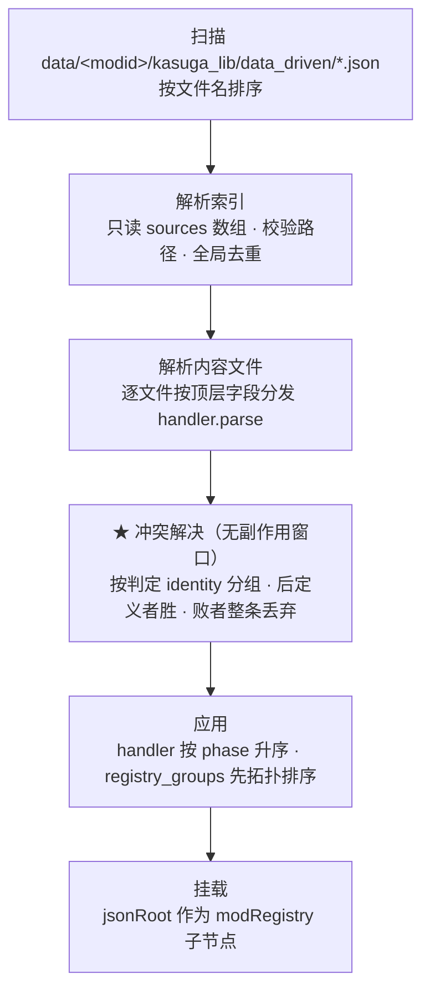
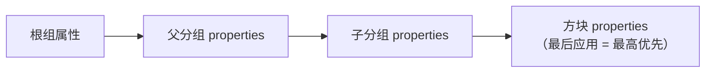

# 数据驱动 API 参考

> 本篇是技术文档：描述代码层面的 API 与系统行为，重点是**直接看代码不容易看出来的部分**——调用时序、排序规则、静默行为、错误处理约定。
> 使用层面的教程见[路径 1](guide-content.md)（内容作者）与[路径 2](guide-extension.md)（模组开发者）。

## 1. 模块与包结构

```text
modules/data-driven/src/main/java/lib/kasuga/registration/data_driven/
├── TypeHandler.java            # 核心接口
├── TypeHandlerRegistry.java    # handler 注册表
├── JsonTreeIntegration.java    # 与 core 注册框架的接入点
├── builder/JsonTreeBuilder.java    # 加载引擎（扫描/解析/分发/应用）
├── context/
│   ├── BuildContext.java       # 构建上下文基类
│   ├── RegBuildContext.java    # 注册场景的上下文（含 Reg 存取）
│   └── JsonRegistryGroup.java  # JSON 创建的分组（RegistryGroup 子类）
├── handler/                    # 内置 handler
│   ├── RegistryGroupHandler.java   # registry_groups，PHASE_GROUPS
│   ├── BlockTypeHandler.java       # blocks，PHASE_CONTENT
│   ├── ItemTypeHandler.java        # items，PHASE_CONTENT
│   ├── BlockEntityTypeHandler.java # block_entities（内嵌），PHASE_EMBEDDED
│   ├── RegTypeHandler.java         # 抽象基类：id 解析/工厂调用/命名空间重写
│   └── MetaTypeHandler.java        # 标记基类（无附加行为，预留）
└── property/
    ├── JsonPropertyParser.java     # 方块属性 → BlockBehaviour.Properties 修改函数
    ├── JsonItemParser.java         # 物品属性 → Item.Properties 修改函数
    └── compiler/PropertyCompiler.java  # 自定义属性匹配器
```

## 2. 加载管线（系统行为）

### 2.1 触发时机

`JsonTreeIntegration` 是 `@Context` bean，`@PostConstruct` 时向 `RegisterContextRegistry` 注册一个 **COMMON 侧回调**。该回调**惰性触发**：首次该 mod 的注册事件分派时才调用 `JsonTreeBuilder.buildForMod(modId)`。

关键推论：所有 `@Context` 类的 static 工厂注册**保证先于** JSON 解析——这是 `@Context` + 惰性加载配合的结果，不依赖任何显式排序。

### 2.2 五阶段管线



各阶段的精确定义：

1. **扫描**：`Files.list` 索引目录，过滤 `.json` 后缀，**按文件名排序**处理。目录不存在时只记 DEBUG（`No data-driven index directory`），不算错误——未使用该系统的 mod 正常通过。
2. **索引解析**：索引文件唯一合法字段是 `sources`（字符串数组）。出现其他顶层字段 → `LOGGER.error` + 计入 loadingErrors（不中断）。路径校验规则见 2.4。
3. **内容解析**：`sources` 指向的文件按**内容文件**解析。每个顶层字段名查 `TypeHandlerRegistry`，字段数组里的每个 JSON 对象调用一次 `handler.parse`。**文件级去重**：同一文件（按路径字符串）在一次 `buildForMod` 内只解析一次，即使被多个索引多次列出。
4. **冲突解决**（本次设计新增）：所有 parse 完成、**任何副作用发生之前**，对每个类型字段按判定 identity 分组（各类型的 identity 规则见 2.6）；同组内**后定义者胜**，败者条目整条移出后续 apply。判定顺序 = 索引文件名升序 × `sources` 数组顺序 × 内容文件内数组顺序，内嵌类型跟随宿主 block。详见 2.6。
5. **应用**：所有 handler 按 `getPhase()` 升序排序后逐个应用；`registry_groups` 在应用前额外按 `parent` 引用做拓扑排序。`parse` 全部完成后才开始 `apply`——**解析与应用是两个独立阶段**，不能在 parse 中依赖 apply 的结果。冲突解决在两者之间，因此不受应用期排序影响。
6. **挂载**：构建出的根 `JsonRegistryGroup`（id 为 `<modid>:json_root`）挂为 mod 注册树的子节点，后续由 core 的 `Reg` 框架正常走注册事件。

### 2.3 phase 语义

| 常量 | 值 | 谁在用 | 为什么 |
|------|-----|--------|--------|
| `PHASE_GROUPS` | 0 | `registry_groups` | 方块/物品要挂到**已存在**的分组上 |
| `PHASE_CONTENT` | 1 | `blocks`、`items` | 常规内容 |
| `PHASE_EMBEDDED` | 2 | `block_entities` | BE 要关联**已存在**的方块 Reg |

同一 phase 内的 handler 顺序 = 注册顺序（`TypeHandlerRegistry` 用 `LinkedHashMap` 保序）。**同一类型内**的条目顺序 = 解析顺序（文件名排序 × 索引数组顺序 × 文件内数组顺序）。除分组拓扑排序与 2.6 的冲突解决外，框架不保证也不依赖这个顺序——**自定义 handler 不应假设条目间的应用顺序**。

`registry_groups` 的拓扑排序细节：父组先于子组；环上的组**不报错**，打 `Cycle detected among registry groups` WARN 后按原始顺序应用——`RegistryGroupHandler.store` 对找不到的 parent 回退挂根组。也就是说：**引用环不会导致丢失分组，只会丢失层级**。

### 2.4 索引路径规则（`sources`）

| 规则 | 违反时的行为 |
|------|--------------|
| 必须以 `.json` 结尾 | `Invalid source path` ERROR + loadingErrors，跳过该条 |
| 禁止前导 `/`、空段、`.`/`..` 段 | 同上 |
| 相对 `data/<modid>/` 解析 | ——（基准不是索引目录，是 data/<modid>/） |
| 不得跨命名空间 | 结构上不可能：路径永远拼接在 `data/<modid>/` 之下 |
| 同一文件多次列出 | 静默跳过（全局 `parsedSources` 集合去重），**不报错** |

内容文件之间**不能互相引用**（没有嵌套 source 机制）——因此不存在循环引用问题，框架也没有对应的环检测。需要拆分文件时在索引里多列几行。

### 2.5 内嵌类型协议（`extractEmbedded`）

每个内容文件解析完常规顶层字段后，框架遍历所有 `getParentTypeName() != null` 的 handler：

- 取父字段（如 `blocks`）的每个 JSON 对象，调用 `handler.extractEmbedded(parentJson)`；
- 返回 `null` 表示"没有内嵌"；返回的每个 `JsonObject` 独立走 `parse` → `apply`。

`BlockEntityTypeHandler` 的参考实现约定：把父对象的 `id` 拷贝进内嵌对象的 `_parent_block` 键，`apply` 时据此用 `context.getBlockReg(...)` 找回父方块。自定义内嵌类型可以采用同样的模式（键名自定）。

### 2.6 冲突解决与 effective id（行为契约）

**冲突定义**：同一**类型字段**（`blocks` / `items` / `registry_groups` / `block_entities`，各自独立）内，两条条目的**判定 identity 相同**。跨类型同 id 不是冲突。

**判定 identity 按类型分支**（`TypeHandler.resolveIdentity`）：

- `blocks` / `items`：id 经**归一化**后的 effective id；
- `block_entities`：**没有自有 id**，其判定 identity = **宿主方块的 effective id**（`BlockEntityTypeHandler.resolveIdentity`，`BlockEntityTypeHandler.java:57-59`；identity 取自内嵌时写入的 `_parent_block` 并经 `EffectiveId.of`）——即两条 BE 条目只要挂在同一个宿主方块上就算冲突，`foo` 与 `minecraft:foo` 这种归一后相同的宿主亦然；
- `registry_groups`：`id` 的**精确字符串**（原串，不过归一化）。

**effective id 归一化**（`blocks` / `items` / `block_entities` 适用；对比的是归一化结果，不是 JSON 里的原始字符串）：

| 原始 id | effective id（`<mod>` = 该 mod 的 id） |
|---------|--------------------------------------|
| `door_m1`（无命名空间） | `<mod>:door_m1` |
| `minecraft:door_m1` | `<mod>:door_m1` |
| `othermod:door_m1` | `othermod:door_m1`（原样） |

依据：`RegTypeHandler.apply` 只在 `namespace != "minecraft"` 时挂自己的 `ResourceLocation` 重写属性（`RegTypeHandler.java:76-79`），否则由根组的重写属性接管（`JsonTreeBuilder.java:74-76`），经 `Reg.applyProperties` 父先子后生效。所以前两行在注册表里实际是同一个 ResourceLocation。

**为什么 `registry_groups` 不归一化**：group 是 loader / Reg 树内部节点，**从不进 MC 注册表**，归一化要解决的"幽灵条目"问题在它身上不存在；且 group id 在 loader 内处处按原串匹配（方块 `registry_group` 字段查表、`RegistryGroupHandler.store` 的 `putRegistryGroup(definition.id(), ...)`）。只归一化**判定键**而不归一化**查表键**，反而会制造"判定认为重复、引用却找不到组"的错配；要引入组级归一化须两者一起改。

**last-wins 判定顺序**（定义顺序，不受 apply 期拓扑排序影响）：

1. 索引文件之间：`data/<mod>/kasuga_lib/data_driven/*.json` 文件名升序；
2. 单索引内：`sources` 数组书写顺序；
3. 单内容文件内：类型字段数组书写顺序；
4. 内嵌类型（`block_entities`）：跟随宿主 `blocks` 条目的位置，不单独排序。

**结果**：

- 后定义者进入 apply（注册表只看到它一次），先定义者**整条不进入 apply**——不存在"注册后再覆盖"，因此不会产生幽灵条目；
- 每条冲突记一条 WARN（含类型字段、判定 identity、胜者与败者各自的 source 文件）+ 一条记入该 mod 的 `loadingErrors`；有冲突时另有一条汇总 WARN；
- 隔离粒度 = 条目级：同文件其它条目、其它类型照常；败者 block 的内嵌 BE 一并隔离。

> **实现状态**：本节逻辑已落地（核对于 2026-09-28），落点在 `lib/kasuga/registration/data_driven/dedup/`（`DuplicateIdResolver` / `EffectiveId`）与各 handler 的 `resolveIdentity`，由 `JsonTreeBuilder.resolveDuplicates` 在 parse 与 apply 之间调用。决策依据与取舍见工作区本地设计文档 `doc/[SDD] data-driven-duplicate-resolution-design.md`（本地文件，不随仓库提交）。

## 3. TypeHandler

```java
public interface TypeHandler<T> {
    int PHASE_GROUPS = 0;
    int PHASE_CONTENT = 1;
    int PHASE_EMBEDDED = 2;

    String getTypeName();
    int getPhase();
    T parse(JsonObject json);
    void apply(T definition, BuildContext context);

    default String getParentTypeName() { return null; }
    default List<JsonObject> extractEmbedded(JsonObject parentJson) { return null; }
}
```

行为约定（框架依赖、实现者必须遵守）：

- `getTypeName()`：在 `TypeHandlerRegistry` 中**唯一**。同名后注册者覆盖先注册者（`Map.put` 语义）。
- `parse`：必须是纯函数。同一 JsonObject 可能被 parse 一次但 apply 一次；解析阶段抛异常会中断整个文件的解析。
- `apply`：框架会捕获其中的异常（`JsonTreeBuilder.applyUnchecked`），打 `Failed to apply ... handler` ERROR 后继续处理后续条目。单条失败不影响其他条目，但也意味着**异常里的详细信息只剩 message**——复杂错误建议在 handler 内自行打 WARN 带上下文。

### RegTypeHandler（注册类 handler 的抽象基类）

`blocks`/`items` 共用的模板方法基类，固化了注册流程，子类只需提供数据提取钩子：

```java
protected abstract String resolveRawId(T definition);        // 完整 id，如 "mymod:xxx"
protected abstract Reg<?, ?> createRegistration(T def, String path);  // 查工厂构造
protected String resolveType(T definition) { return getTypeName(); }  // 诊断用：默认字段名，建议覆写为 definition.type()
protected void configureTypeSpecific(T definition, Reg<?, ?> reg) {}  // 类型特定配置（如属性注入）
protected String resolveRegistryGroup(T definition) { return null; }
protected ResourceLocation resolveCreativeTab(T definition) { return null; }
```

`apply` 的固定流程（子类无需关心）：

1. 拆 id 为 namespace + path（无 `:` 时 namespace 视为 `minecraft`）；
2. `createRegistration` 返回 `null` → `No factory for type '<type>' (id '<id>')` WARN，跳过；
3. namespace 非 `minecraft` 时给 Reg 挂 `ResourceLocation` property——**这是 id 命名空间重写的机制**：Reg 树内生成的所有 ResourceLocation 都会被重定向到目标命名空间；
4. 挂分组（找不到分组则挂根组，不报错）；
5. 标签页：定义级 `resolveCreativeTab` 优先，否则继承分组的 `item_properties.tab`；
6. **重复 id 处理**：冲突在 loader 的 apply 前窗口按判定 identity 解决（见 2.6），败者条目**根本不会进入 `apply`**。`RegTypeHandler.apply` 内**不再**承担重复判定职责；它只负责把 `context.putReg(getTypeName(), ...)` 作为跨 handler 查找的数据源（如 `BlockEntityTypeHandler` 用它找回父方块）。

### 内置 handler 一览

| Handler | typeName | phase | 解析产物 |
|---------|----------|-------|----------|
| `RegistryGroupHandler` | `registry_groups` | GROUPS | `RegistryGroupDef(id, parent, properties, item_properties)` |
| `BlockTypeHandler` | `blocks` | CONTENT | `BlockDef(id, type, registry_group, properties, item_properties, params)` |
| `ItemTypeHandler` | `items` | CONTENT | `ItemDef(id, type, registry_group, properties, params)` |
| `BlockEntityTypeHandler` | `block_entities` | EMBEDDED | `BlockEntityDef(beType, parentBlockId, params)`，由 `extractEmbedded` 从 block 的 `block_entity` 键生成 |

## 4. TypeHandlerRegistry

```java
public static <T> void register(TypeHandler<T> handler);  // 按 getTypeName() 存，重名覆盖
public static TypeHandler<?> get(String typeName);
public static Collection<TypeHandler<?>> all();           // 不可变视图，注册顺序（LinkedHashMap）
public static TypeHandler<?> findByParent(String parentType);  // 按 getParentTypeName() 线性查找，返回第一个
```

- **静态全局表**：所有 mod 共享。当前没有命名空间隔离——自定义 typeName 建议带模组前缀语义（如 `bogeys` 而不是 `things`），避免撞名。撞名时后注册覆盖先注册，且**无告警**。
- `findByParent` 只返回第一个匹配，即**一个父类型最多挂一个内嵌子类型**。

## 5. BuildContext / RegBuildContext

```java
// BuildContext（基类）
String getModId();
JsonRegistryGroup getRootGroup();
<T> void putMeta(String typeName, String id, T value);   // 任意元数据，跨 handler 共享
<T> T getMeta(String typeName, String id);

// RegBuildContext（注册场景子类）
void putRegistryGroup(String id, JsonRegistryGroup group);
JsonRegistryGroup getRegistryGroup(String id);            // 找不到返回 null（调用方应回退根组）
void setRegistryGroupCreativeTab(String groupId, ResourceLocation tab);
ResourceLocation getRegistryGroupCreativeTab(String groupId);
void putReg(String typeName, String id, Reg<?, ?> reg);   // 跨 handler 查找的数据源
Reg<?, ?> getReg(String typeName, String id);
Reg<?, Block> getBlockReg(String id);                     // 等价 getReg("blocks", id)
```

- `putReg`/`getReg` 的 `typeName` 维度即 `getTypeName()`——跨类型查对象时注意用对字段名。
- `putMeta`/`getMeta` 是自定义类型间建立引用关系的标准通道（比 putReg 更通用，不要求值是 `Reg`）。
- context 生命周期 = 一次 `buildForMod` 调用。**跨 mod 不共享**，每次构建都是全新 context。

## 6. FactoryRegistry（core 模块）

```java
public interface BlockFactory        { Reg<?, Block> create(String id, @Nullable JsonObject params); }
public interface ItemFactory         { Reg<?, Item> create(String id, @Nullable JsonObject params); }
public interface BlockEntityFactory  { Reg<?, ?> create(String id, Supplier<Block[]> validBlocks, @Nullable JsonObject params); }
public interface GenericFactory      { Reg<?, ?> create(String id, JsonObject params); }

public static void register(String type, BlockFactory factory);
public static BlockFactory get(String type);              // 未注册返回 null（handler 转 WARN）
public static boolean contains(String type);
public static void registerItem(String type, ItemFactory factory);
public static void registerBlockEntity(String type, BlockEntityFactory factory);
// getBlockEntityFactory / getBlockEntityTypes / getItemFactory 等同构方法
```

- 内部是 `ConcurrentHashMap`，**重复注册同一 type 静默覆盖**，无告警。
- `id` 参数只含 path（namespace 已被 handler 剥离并交给 Reg 的命名空间重写），工厂内部不要再拼 namespace。
- `params` 是定义里 `params` 字段的原始 JsonObject，可为 `null`，**语义完全由工厂定义**。
- `BlockEntityFactory` 的 `validBlocks` 是 `Supplier<Block[]>`——惰性求值，工厂内应存 Supplier 而非立即 `get()`（BE 创建时方块可能尚未实例化完成）。

## 7. 属性解析器

### JsonPropertyParser（方块属性）

```java
public static JsonPropertyParser getInstance();
public List<Function<BlockBehaviour.Properties, BlockBehaviour.Properties>> parseBlockProperties(JsonObject json);
public void registerCompiler(String key, BiFunction<String, JsonElement, Function<...>> supplier);
public void registerCompiler(PropertyCompiler compiler);      // 自定义匹配
public void removeCompiler(PropertyCompiler compiler);
```

行为要点：

- **首个匹配生效**：compiler 列表按序尝试 `valid(key, value)`，第一个命中的 compiler 的 supplier 产出修改函数后立即停止。所以自定义 compiler 若想劫持内置键，需注册在**能先于内置键匹配**的位置——但内置键用精确 ResourceLocation 匹配，建议不要劫持。
- 未匹配键 → `Unknown block property: <key>` WARN，**跳过不报错**。
- 值不合法（如 `strength` 长度不是 2 的数组）→ WARN 并跳过。
- `map_color` 用 `DyeColor.byName` 解析（非法值 WARN）；`sound_type` 用内置 `SoundType` 表（约 60 个 vanilla 下划线命名键，如 `nether_bricks`、`amethyst_cluster`）。

### JsonItemParser（物品属性）

```java
public static final JsonItemParser INSTANCE;
public List<Function<Item.Properties, Item.Properties>> parseItemProperties(JsonObject json);
public void registerParser(String key, ItemPropertyParser parser);   // parser 返回 null 表示跳过
```

- `tab` 是**保留键**：parser 阶段直接跳过，由 handler 层翻译成创造标签页绑定（分组级进 `setRegistryGroupCreativeTab`，定义级走 `CreativeTabModifiers.set`）。
- 未知键 → `Unknown item property: <key>` WARN 并跳过。

### 属性继承与覆盖（系统行为）

属性生效顺序由 `Reg` 树的 property 链决定，**父先子后**，后应用者覆盖先应用者：



物品属性同理：分组 `item_properties` → 方块级 `item_properties`。具体机制：分组与方块级解析出的 `Item.Properties` 修改函数都存在 Reg 的 property 链上，子 ItemReg 在 `applyProperties` 时**沿父链先取分组级、再取方块级**，因此方块级自然覆盖分组级——这是靠应用顺序实现的覆盖，而非字段合并。同名键（如 `stacks_to`）整键覆盖，不做合并。

## 8. 错误收集（按 mod 分桶）

```java
// 按 mod 查询
public static List<Throwable> getLoadingErrors(String modId);          // 该 mod 的不可变快照；无错误返回空列表
public static Map<String, List<Throwable>> getLoadingErrorsByMod();    // 全部 mod，key 按 mod id 排序，不可变
public static List<Throwable> getLoadingErrors();                     // 聚合视图；mod id 混在一起，已知 mod 时优先用上面两个

public static void addLoadingError(String modId, Throwable error);    // 供解析管线与测试写入
public static void clearLoadingErrors(String modId);                   // 只清该 mod
public static void clearLoadingErrors();                              // 清所有 mod
```

- **分桶的意义**：早期是单一全局列表、每次 `buildForMod` 开头清空，调用方只能观察到最后一个 mod 的错误。现在每个 mod 一个 bucket，`buildForMod(modId)` 只清自己的（`JsonTreeBuilder.java:54`），其它 mod 的诊断不会丢。
- 收集范围：索引文件格式错误（缺 `sources`、非法字段、非法路径）、内容文件缺失、解析 IO/JSON 异常、内容文件未知顶层字段 / 字段非数组 / 数组元素非对象、**重复 id 冲突**（见 2.6）。
- **不收集**（WARN 级降级，只进日志）：`No factory for type`、`Unknown block property`、分组环。
- **不会让加载失败**：所有错误都被吞进列表，mod 继续启动。上层（调试命令、集成测试）应主动读这个列表做断言；冲突被记入列表是因为它**改变了加载结果**（有条目没落地），属于结果性差异。
- 若某 mod 无 bucket，`getLoadingErrors(modId)` 返回 `List.of()`（不是 null）。
- `buildForMod` 会在两种异常情形下返回 `null` 并写入错误：索引目录存在但没有任何条目被加载（`:90-97`）；不存在新索引目录但存在已废弃的旧布局目录 `data/<mod>/kasugalib/`（`:57-70`）。正常的"该 mod 不使用数据驱动"（新目录、旧目录都不存在）只记 DEBUG、不写错误。

### 8.1 纯函数路径契约（可被普通 JVM 测试断言）

```java
public static String[] indexDirectorySegments(String modId);
public static String validateSourcePath(String path);
```

- `indexDirectorySegments(modId)` 返回索引目录相对 mod 文件根的段数组，固定为 `{"data", modId, "kasuga_lib", "data_driven"}`——即 `data/<mod_id>/kasuga_lib/data_driven/`。**每次调用返回新数组**，调用方改动不会污染其它调用者。被 `JsonTreeBuilderIndexPathTest` 锁死，拼写回归（`-` 代替 `_`、漏嵌 `kasuga_lib`）会直接让构建失败，而不是运行时静默加载 0 条。
- `validateSourcePath(path)` 返回 `null` 表示合法，否则返回人类可读的原因字符串。规则与 2.4 一致：非空、无前导 `/`、以 `.json` 结尾、无空段、无 `.`/`..` 段。
- 两者都是纯函数、无 NeoForge 依赖，专门暴露出来供不依赖游戏运行时的测试断言路径契约。
