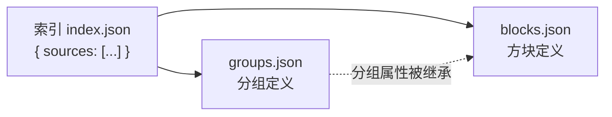
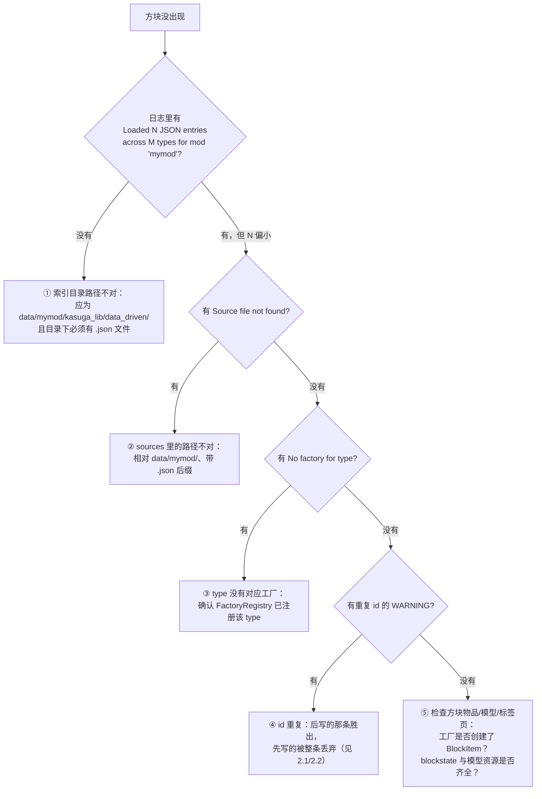

# 路径 1：使用数据驱动文件来添加内容

> 本篇面向**内容作者**：不写 Java，只用 JSON 完成方块、物品、方块实体的注册。
> 读完后你将能够：搭建文件结构 → 注册一个带分组属性的方块 → 为方块绑定方块实体 → 独立排查"方块没出现"的问题。

## 0. 开始前

确认两件事：

1. 你的模组依赖 KasugaLibNext（`lib.kasuga:kasuga_lib`）。
2. `type` 对应的工厂已经存在。库内自带 `simple_block`/`simple_item`/`be_block`/`test_be` 等测试工厂可以直接体验；正式使用时，你的模组需要为自己的 `type` 注册工厂（见路径 2 或向团队的开发者确认可用的 type 清单）。

## 1. 搭建文件结构

在 `src/main/resources/` 下按下面的结构建目录：

```text
src/main/resources/
└── data/mymod/
    ├── kasuga_lib/data_driven/      ← 索引目录（文件清单）
    │   └── index.json
    └── panels/                      ← 内容文件（对象定义）
        ├── groups.json
        └── blocks.json
```

> **注意**：系统会把 `kasuga_lib/data_driven/` 目录下的**所有** `.json` 文件都视为索引文件，尝试读取其中的 `sources` 数组。`index.json` 只是命名建议（便于识别）；文件叫别的名字（如 `mymod.json`）同样会被当作索引解析。因此该目录下不要放内容文件。



> **最佳实践**：内容文件按"一个聚合单位一个文件"组织——比如一个车型、一套家具各一个目录。不要把整个模组的方块塞进一个文件，多文件合并是框架原生支持的（见第 2 步）。

## 2. 写索引文件

索引文件是一份**文件清单**，唯一字段是 `sources`：

```json
{
  "sources": [
    "panels/groups.json",
    "panels/blocks.json"
  ]
}
```

三条硬性规则：

1. 路径相对 `data/mymod/`（不是相对索引文件所在目录），且**必须带 `.json` 后缀**；
2. 不允许跨命名空间——只能引用本模组 `data/` 下的文件；
3. 除 `sources` 外写任何字段都会被拒绝并计入加载错误。

> **最佳实践**：建议按"分组在前、内容在后"书写，方便人读。但要知道**顺序是有语义的**——见 2.1。

### 2.1 `sources` 顺序语义：后写覆盖先写

系统允许你把内容拆到多个文件再合并，代价是**可能写出重复的 id**（复制车型时漏改 id 是最常见的一种）。系统对重复 id 的处理规则是：

> **后定义者胜（last-wins）。** 同一个 id 被定义了多次时，只有**最后定义的那一条**会真正注册；先定义的会被整条丢弃，并在日志里留下 WARNING。

"谁在后"由加载顺序决定，**从外到内**依次是：

1. **索引文件之间**：`data/<modid>/kasuga_lib/data_driven/` 下的 `.json` 按**文件名升序**；
2. **一个索引文件内**：`sources` 数组的**书写顺序**；
3. **一个内容文件内**：该类型数组的**书写顺序**（如 `blocks` 数组里谁写在下面）。

```json
{
  "sources": [
    "panels/base.json",
    "panels/overrides.json"
  ]
}
```

上例中，若两个文件都定义了 `panels:main`，则由 `overrides.json` 的定义生效（它排在后面）。

**这不是 bug，是文档化特性**——它让你可以用"基础文件 + 覆盖文件"的方式做变体/打补丁。但大多数时候你并不想覆盖，只是想新增，所以：

> **最佳实践**：**把顺序当作覆盖开关，而不是当作布局偏好**。如果你没有覆盖意图，就保证 id 全局唯一——重复 id 在正常运行日志里是一条 WARNING，别让它出现。

**"同一个 id" 指什么**：在同一个类型字段内（`blocks` 之间比、`items` 之间比、`registry_groups` 之间比、`block_entities` 之间比）分别比较。**方块 / 物品 / 方块实体**按**归一化后的 id** 比较；**分组**按**字面 id（原串）**比较：

| 你写的 id | 方块 / 物品 / 方块实体参与比较的 id（`<modid>` = 你的模组 id） |
|-----------|---------------------------------------------|
| `door_m1`（不带命名空间） | `<modid>:door_m1` |
| `minecraft:door_m1` | `<modid>:door_m1` |
| `othermod:door_m1` | `othermod:door_m1`（原样） |

也就是说，作为**方块或物品**时，`door_m1` 和 `minecraft:door_m1` **是同一个 id**，会互相冲突；而 `blocks` 里的 `foo` 与 `items` 里的 `foo` **不算冲突**（不同注册表，各注册各的）。

两个需要单独记的点：

- **分组（`registry_groups`）按字面 id 判重**：`door_m1` 与 `minecraft:door_m1` 作为分组 id **不是同一个**，不会互相冲突（分组是内部节点，不进注册表）。
- **方块实体（`block_entities`）没有自己的 id**：它按**宿主方块**的归一化 id 判重——同一个方块上写两个 `block_entity` 才算重复。

### 2.2 重复 id 的具体表现：隔离，而不是崩溃

发现重复时系统的行为：

- **不崩溃**。加载照常完成，游戏正常进。
- **不连坐**。只丢弃冲突中的那一（几）条，文件里其它条目、其它类型照常注册。
- **注册表永远只看到一条**。先定义的那条**不会**被"注册进去又被覆盖"——它根本不会走到注册这一步。这是刻意的，避免 Minecraft 注册表内部出现幽灵条目。
- **会留下证据**：一条 WARNING 日志（给出冲突的 id、类型字段、**胜者和败者各自来自哪个文件**）+ 一条记入该模组加载错误列表的记录。

内嵌的 `block_entity` 跟随它的宿主方块：如果两个方块定义撞了 id，输的那个方块连同它内嵌的 BE 一起被丢弃（不会留下"孤儿 BE"）。

## 3. 写内容文件

### 3.1 分组（registry_groups）

分组是共享属性的容器，组内方块/物品自动继承：

```json
{
  "registry_groups": [
    {
      "id": "mymod:panels",
      "parent": "mymod:base",
      "properties": {
        "no_occlusion": true,
        "strength": [1.5, 3.0],
        "map_color": "blue"
      },
      "item_properties": {
        "tab": "mymod:main_tab"
      }
    }
  ]
}
```

| 字段 | 必需 | 说明 |
|------|------|------|
| `id` | 是 | 建议带命名空间，全局唯一 |
| `parent` | 否 | 父分组，属性逐级继承；不填则挂根 |
| `properties` | 否 | 方块属性，见第 6 节 |
| `item_properties` | 否 | 物品属性（`tab` 指定创造模式标签页） |

`parent` 引用的父组**必须存在**，且祖先链不能成环——否则该组回退挂到根，日志会给出 `Cycle detected among registry groups` 告警。

### 3.2 方块（blocks）

```json
{
  "blocks": [
    {
      "id": "mymod:simple_panel",
      "type": "simple_block",
      "registry_group": "mymod:panels",
      "properties": { "destroy_time": 2.0 },
      "block_entity": {
        "type": "my_be",
        "params": { "tick_interval": 4 }
      }
    }
  ]
}
```

| 字段 | 必需 | 说明 |
|------|------|------|
| `id` | 是 | 格式 `namespace:path`，全局唯一 |
| `type` | 是 | 工厂类型，必须是 `FactoryRegistry` 已注册的 |
| `registry_group` | 否 | 挂载的分组；省略则挂根组 |
| `properties` | 否 | 方块级属性，**覆盖**分组继承值 |
| `item_properties` | 否 | 方块级物品属性，**覆盖**分组继承值 |
| `params` | 否 | 任意 JSON，原样传给工厂（工厂解释语义） |
| `block_entity` | 否 | 内嵌方块实体绑定，见 3.4 |

**优先级一句话**：方块级 > 分组级 > 父分组级。同一字段，越靠近方块的定义越生效。

### 3.3 独立物品（items）

```json
{
  "items": [
    {
      "id": "mymod:steel_ingot",
      "type": "simple_item",
      "registry_group": "mymod:materials",
      "properties": { "stacks_to": 64, "rarity": "uncommon" }
    }
  ]
}
```

> **注意**：方块的物品不是系统自动补的——方块工厂内部自己创建（`withDefaultBlockItem` 或自定义逻辑）。如果某个方块没有对应物品，问题在工厂代码，不在 JSON。

### 3.4 方块实体（block_entity）

方块实体**不占独立顶层字段**，内嵌在 block 定义里：

```json
{
  "blocks": [
    {
      "id": "mymod:signal_block",
      "type": "simple_block",
      "registry_group": "mymod:panels",
      "block_entity": {
        "type": "my_be",
        "params": {}
      }
    }
  ]
}
```

| 字段 | 必需 | 说明 |
|------|------|------|
| `type` | 是 | 方块实体工厂类型（`registerBlockEntity` 注册的） |
| `params` | 否 | 传给方块实体工厂的参数 |

系统行为（了解即可）：系统会在该方块注册完成后，自动创建 BE 并把它挂为方块的子节点，BE 的 id 自动取 `<方块path>_be`。所以**一个 block 只能内嵌一个 block_entity**。

## 4. 进游戏验证

启动客户端，创造模式标签页里搜索你的方块 id。

## 5. 排查：方块没出现

按下面的顺序检查，每一步对应一条日志关键字（`run/logs/debug.log`）：



常见错误日志速查：

| 日志 | 原因 | 处理 |
|------|------|------|
| `Source file not found for mod '...'` | `sources` 路径写错 | 相对 `data/<modid>/`，带 `.json` |
| `Invalid source path '...'` | 路径含 `..`、前导 `/`、空段，或缺 `.json` 后缀 | 修正写法 |
| `Index file '...' must contain a 'sources' array` | 索引文件格式不对 | 索引只写 `{"sources": [...]}` |
| `Index file '...' contains unsupported field '...'` | 把对象定义写进了索引 | 定义移到内容文件 |
| `No factory for type 'xxx' (id 'yyy')` | `type` 未注册工厂 | 注册工厂或改 type |
| 重复 id 的 WARNING（含胜者/败者来源文件） | 同一类型字段内两条定义的判定 identity 相同：方块 / 物品 / 方块实体按归一化 id，分组按字面 id（见 2.1） | 删除其一，或有意用顺序覆盖（见 2.1） |
| `Cycle detected among registry groups` | 分组 parent 成环 | 修复 parent 链 |

> **最佳实践**：所有加载错误都不会让游戏崩溃，而是收集在 `JsonTreeBuilder.getLoadingErrors()` 里并打印日志。集成测试或调试工具可以读这个列表做断言。可以按模组查询：`JsonTreeBuilder.getLoadingErrors(modId)`（返回该模组的列表）、`getLoadingErrorsByMod()`（按模组 id 分桶的 map）。

### 5.1 常见错误自查清单

写完一批 JSON 后，按这个清单自查：

1. **id 是否全局唯一**（同一类型内）？重点检查复制粘贴车型/面板目录后的 id。
2. **id 是否带了预期命名空间**？`door_m1` 与 `minecraft:door_m1` 等价于 `<modid>:door_m1`，别以为它们不同。
3. **`sources` 路径**是否相对 `data/<modid>/`、带 `.json` 后缀、不含 `..`/前导 `/`？
4. **索引文件**是否只写了 `sources` 一个顶层字段？
5. **内容文件顶层字段**是否是系统认识的类型（`blocks`/`items`/`registry_groups`，或你团队注册的 TypeHandler 字段）？未知字段会报错。
6. **`type`** 是否有对应工厂？写错的 `type` 不会崩溃，但方块不会出现（`No factory for type`）。
7. **`registry_group`** 引用的分组是否存在？不存在会静默挂到根组——方块仍会出现，但属性/标签页可能不符预期。
8. **启动日志**里是否有 WARNING？特别是重复 id（会有胜者/败者文件出处）和 `Unknown block property`。
9. 如果集成了自动化测试，**断言 `getLoadingErrors(modId)` 为空**——这是把"静默错误"变成红灯的最省事办法。

## 6. 属性速查

### 方块属性（`properties`，方块与分组通用）

| 属性 | 类型 | 说明 |
|------|------|------|
| `no_occlusion` | boolean | 不遮挡相邻方块 |
| `no_collision` / `no_collission` | boolean | 无碰撞箱（两种拼写都接受） |
| `strength` | number 或 [number, number] | [硬度, 爆炸抗性]；单值 = 两者相同 |
| `destroy_time` / `explosion_resistance` | number | 与 `strength` 互斥的单独写法 |
| `map_color` | string | 染料名，如 `"blue"` |
| `sound_type` | string | 见下方支持列表 |
| `light_emission` | number | 0–15 |
| `friction` / `speed_factor` / `jump_factor` | number | 物理系数 |
| `requires_correct_tool` / `replaceable` / `dynamic_shape` / `random_ticks` / `no_loot_table` / `ignited_by_lava` / `liquid` / `force_solid_on` / `air` / `no_terrain_particles` | boolean | 同名 vanilla 行为 |

`sound_type` 支持值：`stone`、`wood`、`gravel`、`grass`、`sand`、`metal`、`glass`、`wool`、`anvil`、`chain`、`copper`、`basalt`、`netherrack`、`calcite`、`tuff`、`moss_carpet`、`amethyst_cluster`、`cobweb` 等（vanilla `SoundType` 的下划线命名，写错会在日志告警并忽略）。

### 物品属性（`item_properties` / 独立物品的 `properties`）

| 属性 | 类型 | 说明 |
|------|------|------|
| `tab` | string | 创造模式标签页（`namespace:path`） |
| `stacks_to` | number | 最大堆叠 |
| `rarity` | string | `common`/`uncommon`/`rare`/`epic` |
| `fire_resistant` | boolean | 防火 |
| `durability` | number | 最大耐久 |
| `no_repair` | boolean | 禁止铁砧修复 |

> **最佳实践**：把标签页写在**分组**的 `item_properties.tab` 里，整组方块自动进同一个标签页；个别方块需要换页时再在方块级覆盖。
