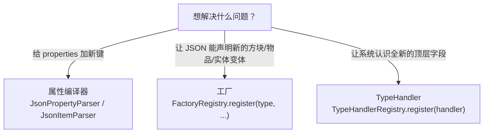
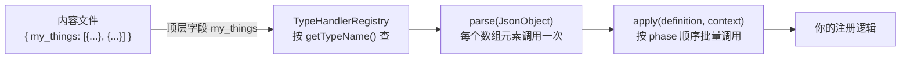

# 路径 2：对数据驱动系统进行拓展

> 本篇面向**模组开发者**：通过少量 Java 代码，让你团队的内容作者能用 JSON 声明你的内容类型。
> 三个拓展点由浅入深：**属性编译器**（给现有方块/物品加新属性）→ **工厂**（加新的 type）→ **TypeHandler**（加全新的顶层字段类型）。

## 0. 拓展点全景



| 你想要 | 注册点 | 典型例子 |
|--------|--------|----------|
| `properties` 里出现新键 `my_prop` | 属性编译器 | `hardness_per_axis: [x, y, z]` |
| `"type": "my_door"` 能构造方块 | `FactoryRegistry` | 门、窗、面板等变体 |
| 内容文件里出现新顶层字段 `"bogeys": [...]` | `TypeHandler` | 转向架、FSM 定义、模型代理 |

## 1. 拓展属性：注册属性编译器

### 1.1 方块属性

`JsonPropertyParser`（单例，`getInstance()` 获取）负责把 `properties` 里的每个键编译为对 `BlockBehaviour.Properties` 的修改函数。注册方式有两种：

```java
// 方式 1：按 key 精确匹配（推荐）
JsonPropertyParser.getInstance().registerCompiler("mymod:my_prop", (key, value) -> {
    int data = value.getAsInt();
    return props -> { props.strength(data); return props; };
});

// 方式 2：自定义匹配逻辑（PropertyCompiler）
JsonPropertyParser.getInstance().registerCompiler(new PropertyCompiler(
    (key, value) -> key.startsWith("mymod:"),          // BiPredicate：这个键归我管吗？
    (key, value) -> { /* 返回修改函数 */ }              // BiFunction：编译为修改函数
));
```

> **最佳实践**：自定义属性的 key 带上模组命名空间前缀（`mymod:xxx`），避免与 vanilla 语义键和其它模组的键冲突。内置键（`strength`、`map_color` 等）没有前缀，是历史约定。

匹配顺序：编译器按注册顺序逐一尝试 `valid(key, value)`，**第一个匹配的生效**。没匹配到时日志打 `Unknown block property` 并忽略该键——不会报错中断。

### 1.2 物品属性

`JsonItemParser.INSTANCE.registerParser(key, parser)`，签名类似，修改对象是 `Item.Properties`：

```java
JsonItemParser.INSTANCE.registerParser("my_durability_bonus", (key, value) -> {
    int bonus = value.getAsInt();
    return props -> { props.durability(bonus); return props; };
});
```

> **注意**：`tab` 是保留键，被框架单独处理（翻译成创造标签页绑定），你的 parser 永远不会收到它，也不需要处理。

## 2. 拓展内容：注册工厂

`type` 是 JSON 与 Java 的接缝。一个工厂 = 一类对象的构造逻辑：

```java
@Context  // 关键：保证 static 初始化先于 JSON 树构建
public class MyFactories {

    private static <T extends Block> Reg<?, Block> blockWithItem(
            String id, Function<BlockBehaviour.Properties, T> supplier) {
        return (Reg<?, Block>) (Reg<?, ?>) BlockReg.of(id, supplier).withDefaultBlockItem(id);
    }

    static {
        // 方块工厂：(path, params) -> Reg
        FactoryRegistry.register("my_door", (id, params) -> blockWithItem(id, MyDoorBlock::new));

        // 读取 params 实现同一工厂的多种变体
        FactoryRegistry.register("my_window", (id, params) -> {
            int height = params != null && params.has("height")
                    ? params.get("height").getAsInt() : 1;
            return blockWithItem(id, () -> new MyWindowBlock(height));
        });

        // 物品工厂
        FactoryRegistry.registerItem("my_material", (id, params) -> ItemReg.of(id, Item::new));

        // 方块实体工厂：(id, validBlocks 供给器, params) -> Reg
        FactoryRegistry.registerBlockEntity("my_be", (id, validBlocks, params) -> {
            BlockEntityReg<MyBlockEntity> reg = new BlockEntityReg<>(id,
                    r -> (pos, state) -> new MyBlockEntity(r.getEntry(), pos, state));
            reg.withProperty(Collection.class,
                col -> { col.addAll(Arrays.asList(validBlocks.get())); return col; });
            return reg;
        });
    }
}
```

> **最佳实践**：
> - 工厂里自行解释 `params`——params 是任意 JSON，语义完全由工厂定义。建议每个工厂在文档里写明支持的键和默认值。
> - 方块要带物品就在工厂里 `withDefaultBlockItem(id)`；系统不会自动补。
> - `@Context` 是 Micronaut 的即刻初始化注解，**必须加**，否则工厂注册晚于 JSON 解析，会出现 `No factory for type` 告警。

## 3. 拓展系统：注册 TypeHandler

当你需要一种**全新的内容类型**——不是方块、不是物品，而是自定义的声明（比如转向架定义、动画定义）——实现 `TypeHandler<T>` 并注册。



### 3.1 接口逐方法说明

```java
public class MyThingHandler implements TypeHandler<MyThingDef> {

    @Override public String getTypeName() { return "my_things"; }

    @Override public int getPhase() { return PHASE_CONTENT; }

    @Override public MyThingDef parse(JsonObject json) {
        return new MyThingDef(json.get("id").getAsString(), /* ... */);
    }

    @Override public void apply(MyThingDef def, BuildContext context) {
        // 用 context.getModId() 做命名空间解析，注册你的对象
    }
}

// 注册时机：@Context static 块中
TypeHandlerRegistry.register(new MyThingHandler());
```

| 方法 | 调用时机 | 说明 |
|------|----------|------|
| `getTypeName()` | 分发时 | 认领内容文件的顶层字段名。内容文件里写 `"my_things": [...]` 就会进入你的 handler |
| `getPhase()` | 应用排序 | 见 3.2 |
| `parse(JsonObject)` | 解析期 | 把数组中的一个 JSON 对象变成你的定义对象。**此时不应有副作用**——只做纯转换，方便上层收集错误 |
| `apply(T, BuildContext)` | 应用期 | 真正执行注册。抛异常只会被记日志、不会中断其他条目 |

### 3.2 phase：应用顺序

`apply` 不是按文件顺序执行的，而是按 `getPhase()` 升序分批应用。框架内置三档常量：

```java
PHASE_GROUPS   = 0  // 分组先创建——方块要挂到已存在的分组上
PHASE_CONTENT  = 1  // 方块、物品等常规内容
PHASE_EMBEDDED = 2  // 内嵌类型——在父对象（方块）之后应用
```

自定义 handler 大多数情况用 `PHASE_CONTENT`；如果你的类型要被别的内容引用（类似分组），用 `PHASE_GROUPS`；如果是附着在已有对象上的附属信息（类似方块实体），用 `PHASE_EMBEDDED` 并配合 `getParentTypeName()`。

> **只看代码看不出来的部分**：`registry_groups` 在应用前会按 `parent` 引用做拓扑排序（父先于子），环会告警并按原顺序回退挂根。如果你的类型也有"引用另一个实例"的语义，建议在 `parse` 阶段只存引用、在 `apply` 阶段通过 `BuildContext` 查找目标——而不是假设定义顺序。

### 3.3 内嵌类型（可选）

如果你的类型像 `block_entity` 一样"寄生"在别的对象里，覆写两个 default 方法：

```java
@Override public String getParentTypeName() { return "blocks"; }

@Override public List<JsonObject> extractEmbedded(JsonObject parentJson) {
    if (!parentJson.has("my_attach")) return null;
    JsonObject attach = parentJson.getAsJsonObject("my_attach").deepCopy();
    attach.addProperty("_parent_block", parentJson.get("id").getAsString());  // 自定约定：带上父 id
    return List.of(attach);
}
```

系统行为：每个内容文件解析完常规字段后，框架会找出 `getParentTypeName() != null` 的 handler，对父字段（这里是 `blocks`）的每个对象调用 `extractEmbedded`，返回的每个 JSON 都会走一次你的 `parse` + `apply`。`_parent_block` 是框架约定俗成的传递方式（BlockEntityTypeHandler 就这么做），你可以定义自己的键。

### 3.4 BuildContext 能拿到什么

`apply` 收到的 `BuildContext`（注册场景是子类 `RegBuildContext`）提供：

| 方法 | 用途 |
|------|------|
| `getModId()` | 当前模组 id，用于构造带命名空间的 ResourceLocation |
| `getRootGroup()` | 根分组，未被任何分组认领的对象挂这里 |
| `getRegistryGroup(id)` | 按 id 查已创建的分组（phase 保证分组先于内容创建） |
| `getBlockReg(id)` | 查已创建的方块 Reg（用于 BE 关联方块等场景） |
| `putReg(typeName, id, reg)` / `getReg(typeName, id)` | 跨 handler 存取注册对象；框架用它做重复 id 检测 |
| `putMeta(typeName, id, value)` / `getMeta(typeName, id)` | 存取任意元数据，适合非 Reg 的自定义定义互相引用 |

> **最佳实践**：把你的定义放进 `putMeta`，别的 handler 就能在自己的 `apply` 里查到它们——这是自定义类型之间建立引用关系（类似 block ↔ block_entity）的标准通道。

## 4. 验证你的拓展

1. 写一个使用新字段/新 type 的内容文件，加进 `sources`。
2. 启动游戏，确认没有 `No factory for type` / `Unknown block property` / `Cycle detected` 告警。
3. 给 `JsonTreeBuilder.getLoadingErrors()` 写个断言（集成测试），保证后续改动不引入静默加载错误。

## 5. 拓展时的红线

- **不要在 `parse` 里注册对象**——`parse` 可能因错误收集被重复触发排查，注册只发生在 `apply`。
- **不要假设条目间的应用顺序**（同一 phase 内按解析顺序，但跨文件顺序取决于索引列举顺序）——依赖关系一律通过 context 查找，而不是顺序假设。
- **不要吞掉异常**——`apply` 抛出的异常会被框架记录（`Failed to apply ... handler`），静默 catch 会让错误只剩半条线索。
