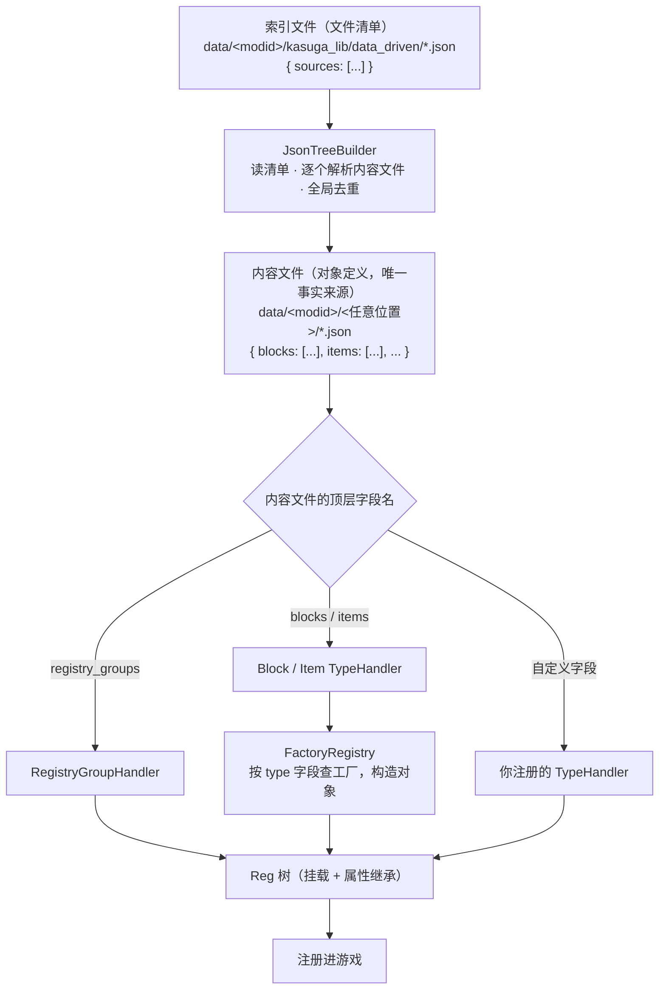

# 数据驱动系统

KasugaLibNext 提供了一整套数据驱动能力，可以从数据文件加载脚本、物品、注册等任何内容，支持高度自定义。

数据驱动适用于下面的场景：

1. 没有技术基础的开发者想要快捷添加模型、物品、方块等
2. 有技术基础的开发者通过编写少量代码，拓展自身模组的数据驱动能力，并提供给团队内无技术基础的成员使用
3. 数据包作者进行数据包开发
4. ...

## 基础概念

数据驱动系统的全部工作围绕三个词展开：**索引**、**内容**、**处理器（TypeHandler）**。

- **索引文件**只回答"要解析哪些文件"，不含任何对象定义、也不声明类型。
- **内容文件**是对象定义的唯一事实来源，顶层字段名（`blocks`/`items`/`registry_groups`/...）决定该字段交给哪个 TypeHandler。
- **TypeHandler** 是"顶层字段 → 解析器"的注册点：任何模块都可以注册自己的字段类型，让数据驱动系统认识新的内容。
- **FactoryRegistry** 是"`type` 字符串 → 构造函数"的注册点：JSON 里的 `type` 字段由它翻译为真正的方块/物品/实体。

这四层各自独立：加一种内容类型不需要改索引格式；加一种工厂不需要改框架代码。

## 快速开始

根据你的角色选择路径：

- **路径 1（超链接）**：[使用数据驱动文件来添加内容](guide-content.md) —— 面向内容作者：写索引、写内容文件、注册方块/物品/方块实体，全程零 Java。
- **路径 2（超链接）**：[对数据驱动系统进行拓展](guide-extension.md) —— 面向模组开发者：注册新的 TypeHandler、新的属性编译器，把团队私有内容接入数据驱动。

两条路径都从零开始，可以按顺序阅读，也可以直接跳到你需要的那篇。

## API 参考

- **（超链接）**：[数据驱动 API](api.md) —— TypeHandler、TypeHandlerRegistry、BuildContext、FactoryRegistry、属性解析器的完整接口说明与系统行为（加载时序、phase 排序、错误收集、属性继承等只看代码不容易看出来的部分）。
