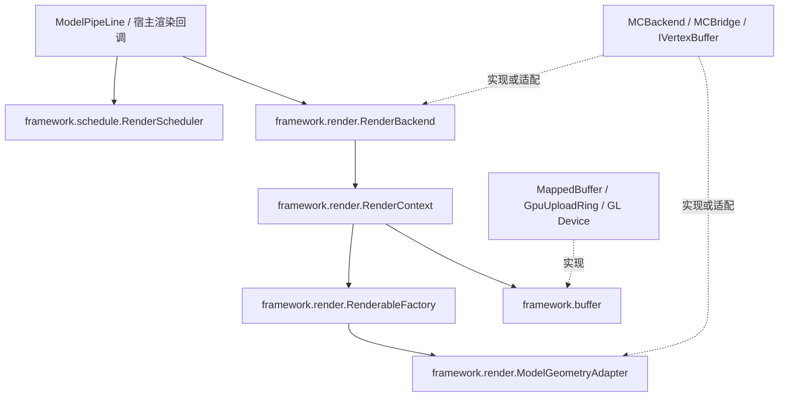

# UML 渲染 framework 与后端接口

`models.uml.framework` 定义从已有渲染实现提取的公共能力。它不依赖
Minecraft、Iris 或 LWJGL；模型结构与 JOML 数学类型仍是公共数据类型。
`uml.bridge` 与 `uml.backend` 负责适配和默认实现，不再作为所有能力的
唯一入口。MC、OpenGL 和平台上传策略留在具体实现中。

## 层级与职责



| 层级 | 接口/实现 | 负责的事项 |
| --- | --- | --- |
| framework.schedule | `RenderScheduler<I>`、`DefaultRenderScheduler<I>` | 实例可见性策略、宿主帧标记、视距限制、卸载清理 |
| framework.schedule | `FrameSampleCache<I>` | 共享帧 token 内跨机位/材质 pass 的身份采样去重 |
| framework.render | `ModelGeometryAdapter` | 顶点/mesh 转换、骨骼绑定选择；不拥有调度和绘制 |
| framework.render | `RenderableFactory<R>` | 为一个实例创建渲染资源，接收明确提供的后端服务 |
| framework.render | `RenderContext<R,Q,E>` | 一个挂载的资源缓存、硬可见性开关、宿主变换/光照元数据、释放 |
| framework.render | `RenderBackend<A,C,Q>` | 挂载注册表、上下文创建、绘制提交、替换与卸载、后端关闭 |
| framework.buffer | `TypedBuffer<T>` | 固定容量 CPU 元素读写、局部/全量更新、借用字节视图 |
| framework.buffer | `UploadBuffer`、`UploadDevice` | 完整快照上传、脏元素范围、在途读保护；设备调用与状态恢复 |
| framework.buffer | `RenderBuffer<D,S>` | 几何上传、更新、绘制及每次消费后的 `markSubmitted` |
| uml.bridge | `Bridge<R>` | 组合几何转换与旧式资源创建入口，兼容旧 pipeline |
| uml.backend | `Backend`、`BackendContext` | 注册表与上下文的默认生命周期实现 |
| mc / uml.backend.gpu | MC 渲染器、OpenGL buffer/device | 原版视锥/光照、shader、VAO/VBO/TBO、Iris 和平台策略 |

## Bridge 与 Backend 的边界

Bridge 提供模型转换规则。后端拥有 executor 等服务，选择上下文类型并
将这些服务显式传给资源工厂。当前 MC 主路径为：

```text
MCBackend.add(key, bridge, instance)
  → MCBackend.createContext(bridge, instance)
  → MCRenderableContext(bridge, instance, factory)
  → factory: bridge.createRenderable(instance, backend.executor)
```

这条路径不需要 Bridge 根据字符串 `mc_backend` 反查 executor。
`Bridge.getBackendContext`、`setBackends/getBackends` 和单参数
`createRenderable/apply` 保留为旧调用的兼容入口；默认 `Backend.createContext`
仍可调用旧工厂。新后端应覆盖 `createContext`，直接返回类型匹配的上下文。
不要让几何适配器负责关闭 executor、帧标记或绘制管线。

`Q` 是宿主帧上下文，`E` 是渲染前元数据，`R` 是挂载资源，互不替代。
`BackendContext` 构造时不分配 `R`，第一次 `apply` 创建并缓存它；默认
`Backend.add` 会提前调用 `apply`，使资源准备成功后才发布挂载。
`beforeRender(Q)` 读取元数据，不采样动画、不创建 buffer；动画采样、
版本更新、morph 和上传由渲染实现完成，不能靠反复重建 context 完成。

## 挂载和释放规约

- 注册表以调用方的 key 匹配挂载；key、adapter、instance、context、资源不可为空。
- 同 key 替换先准备新上下文。准备失败时关闭未发布上下文并保留旧挂载；
  成功后发布新挂载并关闭旧上下文。旧资源释放失败会报告异常，此时新挂载已生效。
- `getRenderingObjects` 是只读视图；挂载变动必须通过 `add/remove`。
- `remove` 先从注册表移除，再释放资源；释放异常可见，不静默忽略。
- context 仅拥有工厂返回的渲染资源，不拥有 `ModelInstance`、Bridge 或共享 executor。
  `close` 幂等，关闭后 `apply` 抛出异常，不能重新分配已卸载的资源。
- Backend 关闭时尝试释放所有挂载，并汇总释放异常；关闭后拒绝新增和提交。
  MC Backend 随后释放合批/透明资源并停止 executor。
- 挂载、buffer 操作和绘制由渲染线程持有；scheduler 独立同步 tick/render 访问。

## 调度规约

framework 模式为 `ALWAYS`、`MANUAL`、`HOST_RENDERER`。MC 的
`VANILLA_RENDERER` 映射为 `HOST_RENDERER`；旧的静态 `ModelRenderScheduler`
仅转发到 `ModelRenderScheduling.scheduler()`。ModelPipeLine 和 MCBackend
使用同一个 framework 调度域。其他后端可创建独立的 `DefaultRenderScheduler`。

实例按对象身份区分。模式切换保留独立的视距限制；`setVisible` 选中 MANUAL。
视距使用宿主世界单位，非正值关闭距离门控，NaN/Infinity 拒绝。
`shouldRender` 只回答策略结果；距离与视锥检查由 backend 按顺序执行。
被剔除的实例不采样、不上传；物理推进继续由独立运行时管理。

宿主 renderer 在自己的可见帧内调用 `markRenderedThisFrame`。第一模型 pass
调用一次 `flipFrame`，后续材质/透明 pass 共用标记；下一次 flip 没有新标记时
旧标记过期。flip 后新标记也立即可见。最后一个挂载移除时清理实例策略和
两组标记；整个渲染域卸载可调用 `resetAll`。MC 的具体时序见
[render-scheduling.md](render-scheduling.md)。

多机位在每次宿主 view pass 前调用 `clearFrameMarks()`，只清除可见性标记，
保留实例策略和视距。`FrameSampleCache.beginFrame(token)` 则在 token 改变时
清空采样集合；同 token 的后续机位通过 `firstSample(instance)` 避免重复采样，
仍能采样只在新机位可见的实例。MC 生产者见 [多机位与离屏输出文档](../docs/offline_rendering_and_multi_cam.md)。

## Buffer 规约

`TypedBuffer` 的 index/offset 以元素计，`sizeOfType/bufferCapacity` 以字节计。
短数组 `updateAll` 只更新前缀，保留容量与尾部；`updateRange` 不得越界，允许
在容量末端写零元素。`slice` 保留打包字节序，并借用内存，不能越过关闭时刻。
实现的直接 `writeData` 也必须检查关闭状态和元素范围。关闭幂等。

`GpuUploadRing` 实现 `UploadBuffer`，旧的 `GpuUploadRing.Device` 继承
framework 的 `UploadDevice`。上传需要完整 direct 快照，dirty bits 是元素
索引，stride 是字节，mergeGap 是元素数。空 dirty 可复用当前 storage；每个
slot 独立补齐自上次上传以来的修改。输入 position/limit 保持不变。

每次 GPU 消费，包括未变化数据的重复 draw 和透明回放，都必须标记
`markSubmitted`。忙 slot 不能覆盖，设备可重新分配 storage；fence 检查不等待。
device 负责 API 调用和绑定状态恢复，ring 拥有 buffer/fence 的释放。
具体 OpenGL 和 macOS TBO orphan 策略继续由原有设备实现提供。

`IVertexBuffer` 继承 `RenderBuffer<FlatModelData, ShaderInstance>`，仅增加
Minecraft `VertexBuffer` 和 GL id 访问。新宿主通过自己的数据/shader 类型接入
framework 合约，无需引用 Minecraft 接口。
