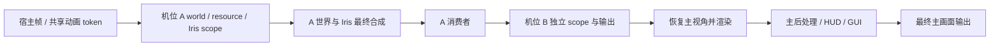

# 离屏输出与多机位渲染

本文对应 Minecraft 1.21.1 / NeoForge 21.1.203；兼容路径实际验证了 Sodium
0.6.13 和 Iris 1.8.12。所有机位在同一个客户端进程、主 OpenGL context
内顺序渲染；多窗口使用共享纹理的辅助 context 展示已完成的画面。机位分别拥有世界缓存、地形渲染器、相机、投影、颜色/深度目标
和 Iris pipeline，主视角仍走原生渲染路径。

离屏输出交付 GPU FBO，游戏 tick 继续运行。无窗口启动入口支持桌面隐藏
context，以及 Linux 无 X11/Wayland 的 EGL pbuffer context。仍需运行完整
Minecraft 客户端及 OpenGL 驱动；目前没有固定时间步离线视频导出器或内置
视频编码器，调用方可以把画面送往自己的合成、编码和传输模块。

## 双机位 DEBUG 启动

```sh
./gradlew :modules:modelling:runClient -PkasugaDebugDualCamera=true

# 可选：进入指定的已有单人世界；省略则从菜单正常进入。
./gradlew :modules:modelling:runClient \
  -PkasugaDebugDualCamera=true \
  -PkasugaQuickPlayWorld=world-view-test \
  -PkasugaClientDirectory=/absolute/path/to/test-client
```

等价的 JVM 开关为 `-Dkasuga.debugDualCamera=true`。默认关闭，不创建 DEBUG
机位或预览目标。进入世界后创建 `debug:first-person` 和 `debug:third-person`，
左侧为第一人称，右侧为第三人称，窗口标题标明左右顺序。两者各有独立
session，FOV 跟随用户设置，尺寸跟随窗口，视距 8 chunks、Fancy、光影关闭。
第三人称沿视线向后 4 blocks，并检查墙体遮挡；第一人称隐藏玩家自身实体。

DEBUG 预览为世界画面，不含第一人称手部或 HUD。打开菜单/背包时暂停并排
合成，正常显示原有界面。退出世界释放机位，下次进入自动重建。主视角仍
执行，DEBUG 合成发生在最终屏幕输出前；此时订阅主视角捕获的也是并排画面。

自动检查只用于隔离的世界副本：

```sh
./gradlew :modules:modelling:runClient \
  -PkasugaDebugDualCamera=true \
  -PkasugaDebugDualCameraCaptureFrames=180 \
  -PkasugaQuickPlayWorld=world-view-test \
  -PkasugaClientDirectory=/absolute/path/to/test-client
```

预览 180 帧后写入 `debug/dual-camera.png`、打印 `DUAL_CAMERA_DEBUG_PASS`
并关闭客户端。普通 DEBUG 开关持续运行，不自动退出。

## 多窗口

```sh
./gradlew :modules:modelling:runClient -PkasugaDebugMultiWindow=true
```

进入世界后，第一和第三人称各有一个独立窗口，MC 主窗口继续显示。可配合
`kasugaQuickPlayWorld` / `kasugaClientDirectory`；测试用
`-PkasugaDebugDualCameraCaptureFrames=120` 在两路均呈现 120 帧后打印
`MULTI_WINDOW_DEBUG_PASS` 并退出。默认不开启。DEBUG 会临时禁用失焦暂停，
结束后恢复原设置；普通 API 调用方可自行设置 `mc.options.pauseOnLostFocus`。

```java
import lib.kasuga.rendering.output.gl.FramePreviewWindow;
import lib.kasuga.rendering.output.mc.MinecraftFrameWindows;

// 同时拥有相机和窗口：关闭任一该机位的原生窗口会释放这个 camera。
var windowCamera = MinecraftFrameWindows.createCamera("monitor:wide", () ->
        new WorldCameraView(100, 80, 100, 0, 20, 0, 70, 640, 360), settings,
        new FramePreviewWindow.Options("Wide camera", 640, 360));
windowCamera.pause();
windowCamera.resume();
windowCamera.resize(1280, 720);
windowCamera.close();

// 只拥有窗口和订阅：关闭这个窗口不会关闭现有相机。
var mirror = MinecraftFrameWindows.open("capture:wide",
        new FramePreviewWindow.Options("Existing camera", 640, 360));
var mainMonitor = MinecraftFrameWindows.open(MinecraftFrameOutputs.MAIN_VIEW,
        new FramePreviewWindow.Options("Final MC + GUI", 640, 360));
mirror.close();
mainMonitor.close();
```

所有操作在 MC 渲染线程调用。相机尺寸随窗口 framebuffer/DPI 改变；最小化时
保留最近有效尺寸。关闭事件每帧处理，暂停机位也可关闭。单独订阅的窗口在
源机位停止发布后保留最后画面，调用方负责关闭它。退出 MC 会统一释放窗口，
之后才释放主 context。

辅助窗口使用共享纹理的 GL context、自己的 read FBO 和双向 GPU fence。
呈现只复制完成的画面，不增加世界渲染；同一机位每帧只捕获一次，多个
订阅共享只读输出 FBO。每个辅助窗口仍有自己的 context-local read FBO，
它只是挂接共享纹理的读取入口，不额外分配一份输出颜色纹理。
纹理读取完成后主 context 才能覆盖下一帧；不使用 CPU `glFinish`。每次呈现
恢复 MC 的 current context / GL capabilities。独立窗口可拉伸，画面保持比例
并留黑边。GLFW 初始化、全局 error callback 和终止仍由 MC 管理。

这不是多个客户端：玩家输入、tick、主窗口事件循环仍属于同一个 MC。
Linux Null/EGL 模式不提供原生窗口，调用多窗口 API 会明确报错。

## 无窗口 MC 启动器

仓库提供 `scripts/run-headless-client.sh` 和 Gradle `runClientHeadless`。
默认使用独立 `modules/modelling/run/headless-client` 目录，不复用日常客户端。
单人 Quick Play 的世界必须已存在于该目录的 `saves/`，也可指定已有目录：

```sh
./scripts/run-headless-client.sh \
  -PkasugaClientDirectory=/absolute/path/to/headless-client \
  -PkasugaQuickPlayWorld=world-view-test \
  -PkasugaHeadlessFps=60

# 或直接连接服务器，需符合该客户端会话的认证条件。
./scripts/run-headless-client.sh -PkasugaHeadlessServer=localhost:25565

# 桌面机器的 Gradle 直接入口。
./gradlew :modules:modelling:runClientHeadless -PkasugaHeadlessBackend=hidden \
  -PkasugaQuickPlayWorld=world-view-test
```

这是本仓库 NeoForge 开发客户端的启动入口，保留 Gradle 的 mod/classpath 配置，
不负责账号登录或视频编码。未指定世界/服务器时启动到离屏菜单，供调用方的
客户端扩展控制；不是自动创建新世界。

| 模式 | GL context | 显示服务 |
| --- | --- | --- |
| `hidden`，macOS/Windows 默认 | 从创建起隐藏的 GLFW 窗口 | 需要桌面显示环境 |
| `egl`，Linux 默认 | GLFW Null 平台 + EGL pbuffer | 不需要 X11/Wayland/Xvfb |

启动前 `prepareHeadlessClient` 在所选客户端目录的 `config/fml.toml` 设置
`earlyWindowControl = false`，避免 NeoForge 在 game mixin 生效前显示 splash。
该设置会保留在此目录。MC 不进入全屏、context 不显示、不启用 vsync，禁用
失焦暂停；渲染帧率单独由 `kasugaHeadlessFps`（默认 60）控制。首次辅助功能
介绍页被跳过，游戏 tick、世界加载、资源包和常规加载界面仍运行。

Linux 需要 Java 21、C 编译器、CMake、`patch`、`curl`，以及支持桌面 OpenGL
的 EGL 驱动。例如 Debian/Ubuntu 的 Mesa 环境可安装 `libegl1`、
`libgl1-mesa-dri`、`build-essential`、`cmake`、`patch`、`curl`。第一次启动脚本
自动下载固定 GLFW 3.4 源码、校验 SHA-256、应用仓库内的小型 pbuffer patch，
编译关闭 X11/Wayland 的共享库。构建产物位于
`modules/modelling/build/headless-glfw/cmake/src/libglfw.so`，后续启动复用。

```sh
# Linux：脚本会 unset DISPLAY / WAYLAND_DISPLAY，并默认 EGL_PLATFORM=surfaceless。
./scripts/run-headless-client.sh -PkasugaQuickPlayWorld=world-view-test

# 预先单独构建，或部署预编译的同架构库。
./scripts/build-headless-glfw.sh
KASUGA_HEADLESS_GLFW_LIBRARY=/opt/kasuga/libglfw.so \
  ./scripts/run-headless-client.sh -PkasugaHeadlessServer=localhost:25565

# 显式使用软件渲染，仅用于无 GPU 环境的功能验证。
LIBGL_ALWAYS_SOFTWARE=1 ALSOFT_DRIVERS=null \
  ./scripts/run-headless-client.sh -PkasugaQuickPlayWorld=world-view-test
```

底层 GLFW 3.4 的普通 EGL 路径只选择 window surface；patch 仅在 Null 平台
选择 pbuffer config 并调用 `eglCreatePbufferSurface`。使用原版 GLFW 库代替
此库不等价。若直接启动 Gradle 的 `egl` 模式，须自行 unset 显示环境变量、
设置 `EGL_PLATFORM=surfaceless` 并传 `-PkasugaHeadlessGlfwLibrary=/absolute/libglfw.so`。
JVM 等价配置为 `-Dkasuga.headless=egl` 与 `-Dorg.lwjgl.glfw.libname=...`，
NeoForge 的早期窗口配置仍须在启动前关闭。

没有显示服务也仍需 GL 驱动。硬件 EGL 取决于驱动支持和 render node 权限；
多机位光影/大材质包仍消耗对应 CPU/GPU 内存。隐藏窗口或 pbuffer 都不会
消除世界渲染成本，软件渲染也不代表生产硬件性能。

## 最终主画面 WYSIWYG 输出

```java
import lib.kasuga.rendering.output.FrameOutputMode;
import lib.kasuga.rendering.output.mc.MinecraftFrameOutputs;

var output = MinecraftFrameOutputs.open(FrameOutputMode.MIRROR, frame -> {
    var texture = frame.resource();
    consumeTexture(texture); // 调用方实现，在渲染线程同步消费。
});
output.close(); // 在渲染线程释放。
```

`MIRROR` 同时交付 FBO 和显示窗口；`OFFSCREEN_ONLY` 成功交付后跳过本帧
屏幕 blit，游戏循环和窗口事件仍继续。关闭所有独占输出后恢复正常显示；
没有独占输出成功时回退到原生窗口输出。

默认 view `minecraft:main` 在 `Minecraft.runTick` 的最终
`RenderTarget.blitToScreen` 处截获，世界、后处理、HUD、GUI、加载界面和
调试面板均已绘制。它复用原生最终 blit，提供最终 WYSIWYG 画面，无需
为了捕获再渲染一遍世界。额外机位通过自己的 world/Iris composition 交付。

## 一次调用创建相机及生命周期

所有创建、更新、暂停、恢复、关闭操作都在渲染线程进行。其他线程使用
`Minecraft.getInstance().execute(...)` 调度；首次创建需要世界已加载。

```java
import lib.kasuga.rendering.output.WorldCameraView;
import lib.kasuga.rendering.output.camera.CameraRenderSettings;
import lib.kasuga.rendering.output.mc.MinecraftCameras;
import java.nio.file.Path;
import java.util.List;
import java.util.Map;

var settings = new CameraRenderSettings(
        12,
        CameraRenderSettings.Quality.FANCY,
        new CameraRenderSettings.Shader(
                Path.of("/absolute/path/to/shader-pack.zip"),
                Map.of("SHADOW_QUALITY", "1")), // 由所选光影包定义的选项名。
        List.of(Path.of("/absolute/path/to/resource-pack.zip")),
        2,    // mipmap 等级 0..4
        true  // ambient occlusion
);
var camera = MinecraftCameras.create("capture:wide", () ->
        new WorldCameraView(100, 80, 100, 45, 15, 0, 70, 1280, 720),
        settings, frame -> consumeTexture(frame.resource()));

camera.pause();
camera.updatePose(new WorldCameraView(110, 82, 100, 90, 10, 0, 50, 1920, 1080));
camera.resume();
camera.close(); // 同时关闭 producer 和它拥有的输出。
```

消费者是示例占位函数。无光影使用 `CameraRenderSettings.Shader.disabled()`。
省略 settings 的重载使用视距 8、Fancy、无光影、基础 vanilla/mod 材质、
mipmap 0、AO 开启。pose 可以传固定记录或每帧一次采样的 provider。

`WorldCameraView` 参数为 x/y/z 世界绝对坐标、yaw/pitch/roll、垂直 FOV、宽/高。
角度单位为度，yaw/pitch 遵循 MC。数值必须有限，FOV 为 `(0, 180)`，尺寸
必须为正且不超过 GL 最大纹理尺寸。新尺寸自动替换渲染和输出 FBO。
view ID 必须非空、唯一，不能使用 `minecraft:main`。

`CameraHandle.state()` 为 READY、PAUSED、FAILED、CLOSED；`failure()` 保存
故障。READY 表示注册可用，初次资源异步加载时可能还没有交付第一帧。
provider、资源加载、绘制或消费者失败会移除该机位并释放资源，保留异常。
`close()` 幂等；暂停停止输出并撤销服务端订阅，恢复后重新订阅。

资源配置在创建时固定，更换包、质量或视距时关闭后重新创建。位置、FOV、
尺寸通过 `updatePose` 动态修改。低层也可分别调用 `MinecraftWorldViews.register`
和 `MinecraftFrameOutputs.open(viewId, ...)`，或给同一 view 添加多个消费者；
低层 producer/消费者需分别关闭。无消费者或未启用的机位不重渲染、不采样。

## 同进程隔离与渲染时序



| 配置或资源 | 隔离方式 |
| --- | --- |
| 位置、朝向、FOV、尺寸 | 每机位 Camera、投影和颜色/深度 FBO |
| 区块与光照 | 每机位 ClientLevel、ClientChunkCache、light engine |
| 地形与实体绘制 | 每机位 LevelRenderer、RenderBuffers、可变实体/方块实体 dispatcher |
| 渲染距离 | 每机位 2..32 chunks，独立服务端订阅与客户端视距 |
| Iris 光影 | 每机位 ShaderPack、PipelineManager、材质设置、uniform 时间、捕获及 shadow 状态 |
| 材质与模型 | 每 pack stack 独立 resource manager、TextureManager、ModelManager、atlas |
| 质量 | 每机位 Fast/Fancy、叶片类型、AO、mipmap |
| 雾与云 | 每机位雾历史；Iris/Sodium 云格式标志按 CloudRenderer 实例保存 |

同一 pack stack/mipmap 的机位共享载入的模型/atlas，以引用计数释放；可变
renderer/dispatcher 各自持有。资源包依列表顺序叠加，后面的优先。基础资源
保留 vanilla/mod resources，不继承主视角选中的用户/服务端包，需要的包
明确写入 `resourcePacks`。目录和 zip 都支持。连接下载的玩家 skin/cape/elytra，
以及共享 light texture、字体 glyph、particle atlas 和没有文件资源的模组生成纹理
为借用资源，不随机位删除。机位自有 atlas 优先，不会被主视角 atlas 替换。

Iris 入口在 scope 内路由到各自实例，部分 static 状态通过切换和恢复隔离。
区块构建任务创建时捕获机位资源、材质和质量，在 worker 执行时恢复上下文。
原版 rebuild task 还持有资源 lease，取消或 CPU 构建结束后才归还，避免关闭
机位时释放仍被异步任务读取的模型/材质。原版 ViewArea 按实际机位坐标定位。
这要求同一 context 顺序渲染，不支持多线程同时绘制机位。

宿主 tick 和 `RenderFrameEvent.Pre/Post` 每帧仍只执行一次，模型动画以共享
frame token 去重；可见标记每机位绘制前清理。scope 内 MC 世界、renderer、
buffers、目标、camera、资源 getter 指向当前机位，world stage 收到机位视锥
与矩阵。自定义时间历史可用 `WorldRenderPipelineContext.viewId()` 分区。

退出 scope 恢复主状态以及 GL read/draw FBO、viewport、投影和绘制/雾状态。
回调内关闭延迟释放至本次交付结束。世界切换销毁旧 session，下次按当前
世界重建；MC 关闭统一释放。vanilla 在途 builder pack 在归还时释放，Sodium
停止其 terrain workers 后释放原生缓冲、sky VBO、pipeline 和 FBO。

## 远处区块与实体

服务端也需安装包含该功能的 KasugaLib；单人集成服务器同样使用协议。
不支持 channel 的服务器会让机位明确失败，不假装加载了远处世界。

服务端按 camera UUID、epoch、维度和中心管理订阅，分批申请 FULL/non-ticking
区块 tickets，不在主线程阻塞等待生成。每订阅每 tick 最多申请 8 个 ticket、
发送 4 个已完成且 light-ready 的快照；方块/光照变化触发重发。客户端把
区块、heightmap、光照及方块实体送进各自 ClientLevel。移动丢弃范围外缓存
与过期 epoch 数据，并清理 light/Sodium tracker。暂停、关闭、登出、维度
变化和 heartbeat 超时撤销服务端 tickets。

实体每 5 ticks 同步 spawn、位置、头朝向、完整 metadata、装备、属性、乘客
和已有 leash 到机位世界，副本独立插值，不消费原版 `packDirty`，保持主玩家
实体追踪。该订阅不是新玩家连接：远处能加载/拍摄，但 non-ticking tickets
不扩展 AI/红石的服务端模拟范围。

## 输出规约与边界

`OutputFrame<FrameTexture>` 提供 view ID、每 view 的帧号、尺寸和颜色纹理。
颜色为 RGBA8、不透明 alpha，OpenGL 左下角原点，无深度附件。router 按
view 拥有颜色目标；同一帧的所有订阅收到同一个 `OutputFrame` 和资源对象，
只借用读取，不可写入、resize 或删除。下一帧覆盖，resize 或最后一个订阅
关闭删除旧对象；回调内取消订阅时，释放推迟到本次交付结束。回调外保留画面
必须当场复制到自己的 GPU/CPU storage，DEBUG 预览也是先复制后合成。
消费者在渲染线程，不应等待编码/网络；可以自行实现 PBO/fence 读回和有界
worker 队列，裸纹理 ID 不能交给没有当前 GL context 的异步线程。

上表内资源已隔离，但并非复制完整客户端：

- 额外机位输出 world stages 和 Iris 最终合成，不包含 HUD/GUI、手部、发光
  轮廓及主视角的 `GameRenderer.postEffect`。完整主画面走最终输出入口。
- 质量支持 Fast/Fancy、AO、mipmap，没有全部 options（Fabulous、粒子预设、
  独立云开关等）。主 light texture、字体、particle engine 和原版 core shader
  loader 共用；修改字体、粒子或 core shaders 的包不能认定完全隔离，远处
  机位也没有独立的服务器粒子事件流。
- 未完整复刻 resource-pack overlays metadata、第三方 reload listener、模组
  实体 pairing payload/attachment、效果与音频协议。
- 第三方代码若直接读 static 状态、缓存主世界或在 world stage 推进逻辑，仍
  需适配；带时间历史的效果应按 view ID 管理。
- 多机位高视距会增加生成、网络、CPU/GPU/显存负载。公开服务器的权限、
  订阅数量和资源预算由上层策略约束。

## 验证

真实客户端用世界副本和隔离目录，检查 shader/shadow session、不同材质
atlas 像素、1024 blocks 外的区块与实体、metadata 默认值恢复、主 RGB 一致、
雾与状态恢复、resize、暂停/恢复、回调关闭及故障释放。

```sh
./gradlew :modules:modelling:modelUnitTest :modules:modelling:renderGlTest
./gradlew :modules:modelling:runClient \
  -PkasugaTestWorldViews=true -PkasugaTestCameraIris=true \
  -PkasugaQuickPlayWorld=world-view-test \
  -PkasugaClientDirectory=/absolute/path/to/test-client

# 不安装 Iris/Sodium 的路径。
./gradlew :modules:modelling:runClient \
  -PkasugaRendererMods=false -PkasugaTestWorldViews=true \
  -PkasugaQuickPlayWorld=world-view-test \
  -PkasugaClientDirectory=/absolute/path/to/vanilla-test-client
```

客户端产物为 `debug/world-views/report.json` 和 PNG，成功标志
`WORLD_VIEWS_SMOKE_PASS`。独立 GL 回归覆盖最终 blit RGB/方向/alpha、resize、
异常状态恢复和资源释放，无需启动完整 MC。

## JFR 测试与性能优化

```sh
./gradlew :modules:modelling:runClient \
  -PkasugaTestCameraPerformance=true \
  -PkasugaQuickPlayWorld=world-view-test \
  -PkasugaClientDirectory=/absolute/path/to/performance-test-client
python3 scripts/analyze-camera-jfr.py \
  /path/to/cameras-4.jfr --output /path/to/analysis.json
```

真实 MC 依次跑 0、1、2、4 个额外机位，最后复测 0；每组预热 8 秒，JFR
`profile` 记录 12 秒。额外机位 1280×720、4 chunks、Fancy、无光影，主视角
使用测试光影，关闭 vsync，空消费者统计交付。测试自动退出，结果为
`debug/camera-performance/` 中各组 JFR 和 `report.json`；不要同时开启 DEBUG
或其他基准。每次运行会覆盖该目录，比较前先复制记录。

2026-10-02，Apple M3 Max，主窗口 1708×960，真实客户端初轮对照：

| 4 个额外机位指标 | 优化前 | 优化后 |
| --- | ---: | ---: |
| 宿主帧 CPU 渲染均值 | 2.913 ms | 2.953 ms |
| 宿主帧 P95 | 3.305 ms | 3.278 ms |
| 宿主帧 P99 | 3.870 ms | 3.500 ms |
| camera pass 平均耗时之和 | 1.262 ms | 0.945 ms |
| 渲染线程分配率 | 207.31 MB/s | 156.70 MB/s |
| 云层路径 allocation samples | 131 | 12 |

根据 JFR 实施两项优化：

1. Iris/Sodium `hadShadersOn` 原为全局标志，主视角开光影、机位关光影时反复
   切换，导致云几何缓存频繁失效。改为 CloudRenderer 每实例保留，在绘制中
   切换/恢复，真实客户端测试覆盖了实际 Mixin 路径。
2. 雾/天空色 Gaussian 采样每次循环产生临时 Vec3。机位采用相同 kernel、
   采样和加法顺序，以标量累积后创建最终 Vec3。200 个固定随机正负/小数
   坐标对比原版，三个分量 double bits 完全一致，216 次取样顺序也相同。
   主视角保持原版路径。

观察到分配率降低约 24%，camera pass 均值之和降低约 25%，整帧均值持平，
不能据此宣称 FPS 提升。初次 0 机位均值 2.900 ms、结束复测 1.601 ms，显示
预热/世界活动/环境波动明显。两轮不是锁定世界状态的统计 A/B，也未覆盖
复杂商用光影、大实体场景或其他 GPU。

宿主帧计时为 `RenderFrameEvent.Pre/Post`，未等待 GPU 完成，不代表完整
swap/present、编码或端到端延迟。`kasuga.CameraRenderPass` 记录 world + Iris
final composition，不含输出 blit/消费者；`kasuga.CameraChunkSnapshot` 记录
服务器快照构建/编码。分配率用 `jdk.ThreadAllocationStatistics` 差值/时间；
不要累计 `ObjectAllocationSample.weight`，首次样本可能带录制前分配。
allocation sample 数量是定位依据，不是精确字节数。

原始记录在 `../modules/modelling/build/camera-performance-baseline` 和
`modules/modelling/build/camera-performance-optimized/`，属于本地构建产物。
剩余热点主要是 biome/noise 读取、地形/实体视锥筛选和实体顶点构建。后续
应在复杂场景复测；实体每 5 ticks 的完整状态可进一步按值去重，但要保留
回到默认值时的同步语义。

## 不显示窗口画面的 FBO 数据流如何调用

无窗口启动后，同样使用下面的 FBO API。`MinecraftCameras.create` 自带离屏
消费者；`MinecraftFrameOutputs.open` 订阅最终主画面。启动器保留一个主画面
`OFFSCREEN_ONLY` 输出，包括加载界面，因此关闭调用方的输出也不会显示 MC
窗口。启动器和调用方的主画面订阅共享一个捕获目标，不额外复制一帧。
正常桌面启动时，主画面订阅可选 `OFFSCREEN_ONLY`，关闭后恢复显示。

### GPU 内直接传递

```java
var camera = MinecraftCameras.create("export:camera", () ->
        new WorldCameraView(100, 80, 100, 0, 20, 0, 70, 1280, 720), frame -> {
    FrameTexture texture = frame.resource();
    // 在这个回调和当前 GL context 中，使用 texture.textureId() 采样/合成，
    // 或从 texture.framebufferId() blit 到调用方持有的 FBO。
});
```

同步只读消费者直接共享上面的句柄，不需要先复制。比如一个机位同时
订阅两个预览窗口和一个 GPU 合成器，router 只创建一份输出颜色纹理、
每帧只执行一次最终捕获；窗口呈现到各自屏幕仍各需一次 blit。关闭其中
一个消费者不会释放其他消费者正在用的画面，消费者异常也只取消其订阅。
捕获本身失败则取消该 view 的所有订阅，其他机位继续工作。

纹理 ID 是 GL 对象句柄，不是可被 CPU 解引用的指针，仅在本进程相应 GL
context/share group 有意义。即使只读，CPU 编码器仍需回读。若后续帧或异步
消费者还需要它，必须在回调里复制到自有 FBO，并在 GL/render 线程管理复制目标和 fence，不能
把借用的 ID 直接放入后台队列。DEBUG 预览的 `OutputFramebuffer.capture`
加 `glBlitFramebuffer` 是一份实际的 GPU 复制示例，见
[`DualCameraDebug`](../modules/modelling/src/main/java/lib/kasuga/rendering/output/mc/DualCameraDebug.java)。

### CPU 字节流：最小可用录制示例

提供 `RgbaReadback.copy(FrameTexture)`：在回调中返回**调用方拥有的**紧密排列
RGBA8 `byte[]`，已翻转为左上角原点，无 stride padding。它恢复 read FBO、
read buffer、pixel-pack buffer 和 pack 参数；返回后 byte[] 可交给无 GL
context 的线程。该实现是同步 `glReadPixels`，会等待 GPU，适合功能验证，
高吞吐录制应替换为 PBO/fence 多槽读回。

以下片段固定 1280×720，把一个机位写为可编码的原始 RGBA 文件；创建/关闭
camera 在渲染线程，磁盘写入在单独线程。调用方应先创建输出目录：

```java
import lib.kasuga.rendering.output.WorldCameraView;
import lib.kasuga.rendering.output.gl.RgbaReadback;
import lib.kasuga.rendering.output.mc.MinecraftCameras;
import java.nio.file.Files;
import java.nio.file.Path;
import java.util.concurrent.ArrayBlockingQueue;
import java.util.concurrent.Executors;
import java.util.concurrent.TimeUnit;
import java.util.concurrent.atomic.AtomicBoolean;

var queue = new ArrayBlockingQueue<byte[]>(2);
var running = new AtomicBoolean(true);
var writer = Executors.newSingleThreadExecutor();
// 保留 future；结束后检查 get()，使磁盘错误可见。
var writeResult = writer.submit(() -> {
    try (var stream = Files.newOutputStream(Path.of("capture.rgba"))) {
        while (running.get() || !queue.isEmpty()) {
            byte[] rgba = queue.poll(100, TimeUnit.MILLISECONDS);
            if (rgba != null) stream.write(rgba);
        }
    }
    return null;
});
var camera = MinecraftCameras.create("export:camera", () ->
        new WorldCameraView(100, 80, 100, 0, 20, 0, 70, 1280, 720), frame -> {
    if (writeResult.isDone()) {
        try { writeResult.get(); }
        catch (Exception failure) { throw new IllegalStateException("Output writer failed", failure); }
        throw new IllegalStateException("Output writer stopped");
    }
    if (queue.remainingCapacity() == 0) return; // 有界队列满时丢帧，不阻塞宿主。
    queue.offer(RgbaReadback.copy(frame.resource()));
});

// 录制结束：在渲染线程关闭 camera，然后通知 writer 排空剩余数据。
try { camera.close(); }
finally { running.set(false); writer.shutdown(); }
// 在后台控制线程等待 writeResult.get()，不要在渲染线程等待磁盘。
```

输出文件顺序为逐帧、逐行 RGBA，单帧大小 `1280 * 720 * 4` bytes。可用 FFmpeg
转换为视频：

```sh
ffmpeg -f rawvideo -pixel_format rgba -video_size 1280x720 -framerate 60 \
  -i capture.rgba -c:v libx264 -pix_fmt yuv420p capture.mp4
```

这里的 60 是对文件帧序列的播放解释，并非保证 MC 按 60 FPS 采样；队列满
会丢帧，游戏也按真实时间 tick。需要准确时长/固定时间步的离线渲染时，还
需要调度时间、按时间戳补帧或离线推进，以及编码器背压策略。连续流期间
分辨率必须固定，resize 后需重新配置编码器/开始新片段。

只想导出最终主画面时把上述 create 换为：

```java
var output = MinecraftFrameOutputs.open(FrameOutputMode.OFFSCREEN_ONLY, frame -> {
    byte[] rgba = RgbaReadback.copy(frame.resource());
    // 按相同有界队列规约交付；尺寸使用 frame.width()/frame.height()。
});
// 结束时 output.close()。
```

流向为 `world/Iris → 每 view 一次最终 blit → 共享输出 FBO → 同步只读回调 → 自有 GPU 副本或
RGBA 字节 → 有界后台队列 → 编码/磁盘/网络`。额外机位不含 HUD，主视角含
完整最终画面。公开 API 的纹理输出和读回已实现；示例视频编码属于调用方。

## 玩家运动同步修正

机位订阅每 5 ticks 发送实体状态，而原版 teleport handler 用 3 ticks 插值，
会出现两 ticks 停顿。远处机位实体改为按 5 ticks 插值。对于主客户端已经
追踪的实体，机位在每次渲染前复制其位置、上一 tick 位置、旋转及 limb
animation 历史到独立副本；玩家的客户端预测移动不再绕服务端订阅一圈。
保留独立 Entity/ClientLevel，FOV/渲染资源隔离不受影响。

真实客户端回归让玩家连续移动/转向/改变步行动画，在 120 个输出帧的
partial tick 0、0.25、0.75、1 检查副本位置插值、旋转历史与动画相位一致：

```sh
./gradlew :modules:modelling:runClient -PkasugaTestCameraMotion=true \
  -PkasugaQuickPlayWorld=world-view-test \
  -PkasugaClientDirectory=/absolute/path/to/test-client
```

此测试主动修改隔离世界内的玩家位置，结束时恢复。成功标志
`CAMERA_MOTION_SMOKE_PASS`，报告为 `debug/camera-motion.json`。


## 最终代码复测

加入玩家运动修正、原版远处地形定位与 RGBA 读回接口后，再跑相同的 JFR
场景（空消费者，不包含同步 CPU 读回成本）：

| 额外机位数 | CPU 渲染均值 | P95 | P99 |
| --- | ---: | ---: | ---: |
| 0，初次 | 2.198 ms | 4.053 ms | 5.440 ms |
| 1 | 2.033 ms | 2.543 ms | 2.852 ms |
| 2 | 2.125 ms | 2.534 ms | 2.952 ms |
| 4 | 2.846 ms | 3.267 ms | 3.878 ms |
| 0，结束复测 | 1.253 ms | 1.479 ms | 1.657 ms |

4 机位渲染线程分配率为 **138.14 MB/s**，camera pass 均值之和为 **1.040 ms**，
云层路径 allocation samples 为 14。相对最初 207.31 MB/s 的记录，观察到约
33% 的分配率下降，整帧耗时仍属接近的水平；上述预热与非锁定世界限制依然
适用。不能把“1 机位比初次 0 机位快”解释为额外机位有加速作用。
记录及分析保留于 `../modules/modelling/build/camera-performance-final`。

验证汇总：625 个 JVM 用例，0 failures/errors，1 skipped；9 组独立 GL 检查
通过，包含 RGBA 方向、alpha、PBO/pack 状态恢复；原版和 Iris 客户端多机位
检查、双机位 DEBUG 实际输出、120 帧玩家运动回归以及最终 JFR 测试通过。
集成服务器的区块/实体订阅路径实际运行过，独立 dedicated server 与任意
第三方光影/材质组合不在这次验证覆盖范围内。

## 多窗口与无窗口启动的验证及补充优化

新增功能完成后，`renderingReleaseCheck` 通过；JVM 检查为 **627 用例，
0 failures/errors，1 skipped**。独立 GL 回归为 **10 组**，新增共享窗口纹理
呈现、双向 fence、current context/capabilities 恢复、resize、窗口独立关闭，
以及 Sodium 类型的 RGBA native blit 保持 RGB、强制输出 alpha=1。

| 实际检查 | 结果 |
| --- | --- |
| macOS MC + Iris/Sodium，多机位窗口及现有机位镜像 | 通过；暂停机位关闭、DPI resize、一个窗口关闭后其他机位继续 |
| 多窗口第一/第三人称 DEBUG 启动 | `MULTI_WINDOW_DEBUG_PASS` |
| macOS `run-headless-client.sh` 隐藏模式 | `HEADLESS_CLIENT_SMOKE_PASS`，主画面及两机位 PNG |
| Debian 12 aarch64，无 DISPLAY / WAYLAND_DISPLAY，GLFW Null + EGL | `HEADLESS_CLIENT_SMOKE_PASS`，主画面及两机位 PNG |

Linux 验证使用 Mesa 22.3.6 的 llvmpipe / OpenGL 4.5，**没有启动 Xvfb**。
检查原生窗口始终不可见、context 归位、没有 GL error、RGBA 非空且 alpha
不透明。主画面 PNG 包含手部/HUD，机位 PNG 为各自的世界视图；JFR 也记录了
两机位各 80 次 render pass。运行的是该 NeoForge 客户端配置导出的 JVM /
classpath，VM 内未重新构建整个 Gradle 项目。此项证明无显示服务的客户端
渲染路径可运行，不证明 NVIDIA/AMD 硬件 EGL、Windows 或所有第三方光影组合。

测试 VM 临时使用 12 GiB 内存、6.5 GiB Java 堆，载入了本机大型测试模型，
包含三张 16384×8192 atlas；这不是最小运行内存要求。产物保存在忽略的
`modules/modelling/build/headless-linux-smoke/debug` 和 `headless-linux-jfr`。

额外修正了两个启动/后台性能问题：

- GLFW Null 的 `glfwWaitEventsTimeout` 是空函数，MC 的限帧循环会忙等。
  EGL 模式改为 `LockSupport.parkNanos`，仍由原来的 frame deadline 循环
  处理提前唤醒。相同 60 FPS 离屏菜单各录制 4 秒 JFR：优化前 74 个渲染线程
  execution samples 中有 26 个在 `limitDisplayFPS`，优化后 50 个样本中为 0。
  这是短时间 CPU 采样证据，不能当成世界渲染 FPS 提升或精确 CPU 百分比。
- PBR 缓存 key 原来临时分配整图 `int[]` 和等大的 byte buffer，增加
  `8 × width × height` 字节 scratch。现在按 4096 像素分块，scratch 为
  32 KiB，SHA-256 的 descriptor、尺寸、大端 ARGB 顺序不变。测试覆盖 chunk
  边界、不同 raster 格式和 subimage，旧磁盘缓存保持有效。原始图像、烘焙
  结果、GPU atlas 的实际内存需求仍存在。

此前 0/1/2/4 机位 JFR 表不包含新增窗口呈现或同步 CPU 读回成本，不能将其
耗时直接套用到多窗口或软件 EGL 部署。


## 只读消费者共享完成帧

输出 router 已改为按 view 捕获和持有 storage。同一帧所有订阅收到同一个
`OutputFrame<FrameTexture>`，最后一个订阅关闭后才释放共享目标；回调中关闭
或替换订阅不会提前删除借用纹理。首次注册选择目标 factory，首次有效输出
才分配 GPU storage。不同 view 仍各自拥有输出目标。

| 同一 view 的 N 个同步只读订阅 | 修改前 | 修改后 |
| --- | --- | --- |
| 输出颜色纹理 / FBO | N 份 | 1 份 |
| 每帧最终捕获 | N 次 | 1 次 |
| 每帧捕获的 alpha 初始化操作 | 2N 次 clear | 2 次 clear |
| 消费者调用 | N 次 | N 次 |

RGBA8 颜色 storage 的名义大小是 `4 × width × height` 字节；1080p 约
7.91 MiB、4K 约 31.64 MiB。上表不计 driver metadata、世界渲染目标、窗口
呈现或消费者自己的复制/编码 storage。`MIRROR` 主画面仍需要正常屏幕 blit，
每个辅助窗口也仍需要呈现；共享捕获并不省掉这些消费者的工作。

此修改没有加入 CPU 零拷贝或异步读回。GPU 纹理 ID 不是 CPU 地址，
`RgbaReadback.copy` 仍执行同步 GPU 回读、Java 数组复制和 Y 翻转。只读 GPU
消费者直接借用句柄即可；跨帧、异步消费需自有 storage 和同步机制。

本轮 JVM 检查 **633 用例，0 failures/errors，1 skipped**，独立 GL **10 组**
通过，`renderingReleaseCheck` 通过。新增 GL 断言实测三个订阅只分配一个
输出目标、每帧只捕获一次，消费者失败后仍可读取正确 RGB/alpha，resize
和最后订阅关闭释放旧 GL 对象。真实 MC 菜单检查通过共享帧身份、完整 GUI
逐像素一致、resize、回调内替换订阅、最后订阅释放和消费者故障回退。
这些结果验证捕获次数和资源所有权，没有测量独立 GPU 毫秒耗时；前文 JFR
数据为修改前的整帧结果，不能据此声称本次共享捕获的具体 FPS 提升。

共享捕获版本还重新通过 macOS MC + Iris/Sodium 的多机位窗口回归
（`FRAME_WINDOWS_SMOKE_PASS`，独立关闭与 resize）和隐藏窗口启动回归
（`HEADLESS_CLIENT_SMOKE_PASS`，主画面加两机位输出）。本轮没有重跑 Linux
无显示服务测试；前文 Linux 记录属于此前的启动器验证。
